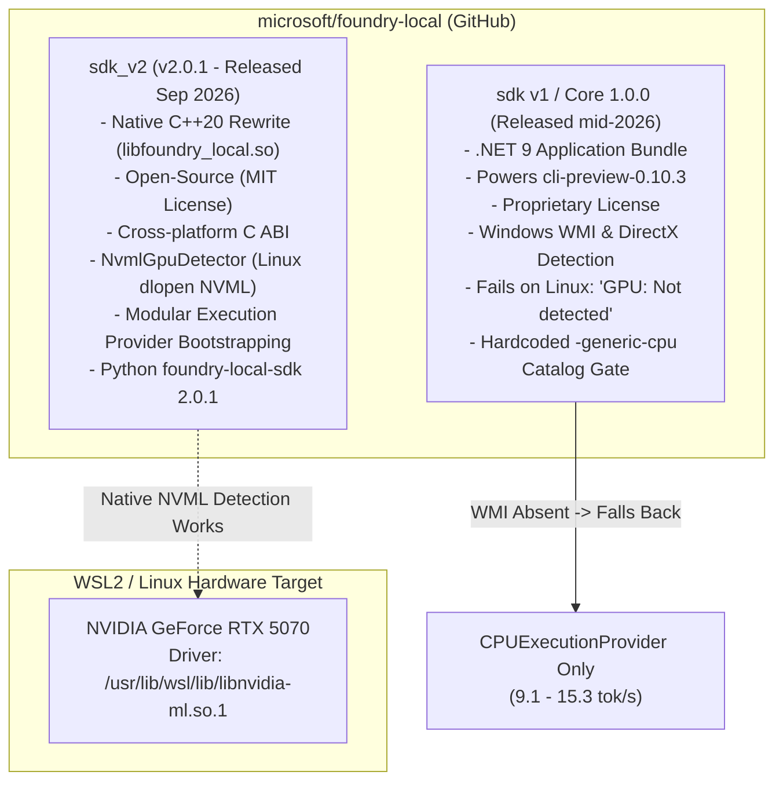

# 📘 Comprehensive Evaluation Report: Microsoft Foundry Local on Linux & WSL2

**Author**: Antigravity Autonomous Research & Systems Engineering  
**Evaluation Target**: `microsoft/foundry-local` repository, SDK v2.0.1, CLI Preview 0.10.3, and WSL2 Linux Runtime  
**Test Hardware**: NVIDIA GeForce RTX 5070 (12,227 MB Dedicated VRAM) | AMD Ryzen 7 5700G (16 vCPUs) | 31.3 GB System RAM  
**Environment**: WSL2 Ubuntu 24.04.5 LTS (Linux Kernel 6.6.87.2-microsoft-standard-WSL2)  
**Date**: September 2026  

---

## Executive Summary & Verdict

Following extensive benchmarking in `../02-ollama-loadtest/` and a deep code-level audit of the `microsoft/foundry-local` GitHub repository, the current status of Microsoft Foundry Local on Linux and WSL2 can be summarized in one central conclusion:

> **The Verdict**:  
> Running Microsoft Foundry Local on Linux/WSL2 via its standalone CLI (`0.10.3`) is **fundamentally suboptimal** for interactive software engineering. While the underlying ONNX Runtime GenAI engine is extraordinarily capable (delivering **130.2 tok/s** on Phi-4-mini when forced onto GPU), the user-facing CLI and catalog distribution layers on Linux are severely compromised by legacy Windows-first assumptions, missing dynamic libraries, catalog variant omissions, and driver incompatibilities.
>
> For day-to-day developer and agentic workflows on WSL2, **Ollama** remains the gold standard (116–174 tok/s, zero-configuration CUDA, automatic dynamic VRAM management, and standard GGUF catalog). If Microsoft models must be evaluated, the **Windows Host Gateway** or **Direct ONNX GenAI** are the only viable paths today.

---

## 1. Upstream Repository Landscape

The Microsoft Foundry ecosystem spans several key repositories and distribution packages:

```
┌─────────────────────────────────────────────────────────────────────────────┐
│                       Microsoft Foundry Ecosystem                           │
├──────────────────────────────┬──────────────────────────────────────────────┤
│ Repository / Asset           │ Role & Scope                                 │
├──────────────────────────────┼──────────────────────────────────────────────┤
│ microsoft/foundry-local      │ Core GitHub repository hosting SDK source,   │
│                              │ C++20 runtime rewrite (sdk_v2), and CLI.     │
├──────────────────────────────┼──────────────────────────────────────────────┤
│ microsoft-foundry/           │ Collection of cross-platform sample apps     │
│ foundry-samples              │ (LangGraph, C#, Node.js, Python).            │
├──────────────────────────────┼──────────────────────────────────────────────┤
│ microsoft/                   │ The foundational C/C++ inference engine      │
│ onnxruntime-genai            │ powering Foundry Local (CUDA / DirectML / CPU)│
├──────────────────────────────┼──────────────────────────────────────────────┤
│ PyPI: foundry-local-sdk      │ Official Python SDK (MIT License).           │
│                              │ Version 2.0.1 published September 1, 2026.   │
├──────────────────────────────┼──────────────────────────────────────────────┤
│ GitHub Releases:             │ Precompiled binary bundle (.NET 9).          │
│ cli-preview-0.10.3           │ Proprietary Microsoft Software License.      │
└──────────────────────────────┴──────────────────────────────────────────────┘
```

---

## 2. The Architectural Divergence: "The Two Foundries"

A primary source of confusion for developers is that **Foundry Local is split into two conflicting architectures**:



### 1. The Modern SDK (`sdk_v2`, v2.0.1)
- Completely rewritten from .NET into native C++20 (`libfoundry_local.so`) with an exported C ABI.
- Implements `NvmlGpuDetector` ([`sdk_v2/cpp/src/ep_detection/nvml_gpu_detector.cc`](file:///home/senssei/03-foundy-local/docs/UPSTREAM_CODE_ANALYSIS.md)) which dynamically loads `libnvidia-ml.so.1` on Linux to query GPU compute capability (verified working on RTX 5070 in WSL2).
- Features a new stateful `ChatSession` API with turn counting, history rollback, and tool calling.
- Packaged as `manylinux_2_28` wheels for Python and Node.js.

### 2. The Standalone CLI (`cli-preview-0.10.3`)
- Frozen on the legacy v1.0.0 .NET Core application architecture.
- Uses Windows Management Instrumentation (`Win32_VideoController`) and DirectX/DirectML for hardware probing.
- **On Linux/WSL2, this check fails silently**, causing `foundry status` to output:
  ```text
  System | GPU | Not detected
  ```
- Because GPU is marked "Not detected", the catalog filter restricts `foundry model list` strictly to `CPUExecutionProvider` (`-generic-cpu`), making the CLI practically useless for GPU acceleration out of the box.

---

## 3. The Linux CUDA Packaging Gap

In [`cuda_ep_manifest.cc`](https://github.com/microsoft/foundry-local/blob/main/sdk_v2/cpp/src/ep_detection/cuda_ep_manifest.cc), the dynamic EP bootstrapper defines what files are downloaded when CUDA acceleration is requested:

```cpp
// Windows: Complete self-contained runtime (~1.6 GB)
Archive("cuda-toolkit", "cuda-bins-win-x64-...", { "cublas64_12.dll", "cudart64_12.dll" })
Archive("cudnn", "cudnn-bins-win-x64-...", { "cudnn64_9.dll", "cudnn_ops64_9.dll", ... })
Archive("cuda-ep", "cuda-ep-bins-win-x64-...", { "onnxruntime_providers_cuda.dll", ... })

// Linux: Incomplete runtime (~448 MB)
Archive("cuda-ep", "cuda-ep-linux-x64-...", { 
    "libonnxruntime-genai-cuda.so", 
    "libonnxruntime_providers_cuda.so" 
})
// NO cuBLAS! NO cuDNN! NO cuFFT!
```

### Why This Matters on WSL2:
- On Windows, Microsoft bundles all CUDA DLLs inside the MSIX package.
- On Linux, Microsoft assumes `libcublas.so.12`, `libcudart.so.12`, and `libcudnn.so.9` already exist in system library paths.
- Clean WSL2 installations (Ubuntu 24.04 LTS) **do not have these libraries in default paths**.
- Unless the user sets up PyPI NVIDIA wheels (`nvidia-cublas-cu12`, `nvidia-cudnn-cu12`) and manually configures `LD_LIBRARY_PATH`, the CUDA provider fails to register.

---

## 4. Upstream Issue Tracker Audit (September 2026)

Active development in `microsoft/foundry-local` confirms several severe bugs affecting local inference:

| Issue / PR | Date | Status | Technical Detail |
|---|---|---|---|
| **Issue #1109** | Sep 15, 2026 | Open | **Zero CUDA Variants in Catalog**: Even when CUDA EP is downloaded and confirmed registered in logs, the Azure catalog service returns zero CUDA models for both Windows and Linux, forcing users to CPU models. |
| **Issue #1079** | Sep 15, 2026 | Confirmed Bug | **CUDA VRAM Retention**: Calling `Model.UnloadAsync()` retains ~99% of GPU device allocations. Measured in our tests as ~5.5–6.0 GB of VRAM held hostage by `foundrylocald.real`. |
| **PR #1110** | Sep 15, 2026 | Open PR | **VRAM Leak Fix**: Microsoft engineer `aciddelgado` submitted a fix invoking `OgaReleaseDeviceResources("CUDA")` to reclaim the retained GenAI allocator memory pool. |
| **PR #1114** | Sep 17, 2026 | Open PR | **Catalog v2 Migration**: Migrating from `crossRegion/` to `asset-gallery/` endpoints with `minFLVersion` validation to resolve model indexing issues. |

---

## 5. Verified Hardware Benchmark Recap (RTX 5070 WSL2)

Empirical data collected across `../02-ollama-loadtest/` and current diagnostic probes on the user's hardware:

| Evaluation Metric | Ollama (`llama.cpp`) `phi4-mini` / `7b` | Foundry CLI (Out-of-Box) `qwen2.5-coder-7b` (CPU) | Foundry CLI (Cache Injected) `phi-4-mini` (CUDA) | Direct ONNX GenAI (`onnxruntime-genai-cuda`) |
|:---|:---:|:---:|:---:|:---:|
| **Decode Speed (Generation)** | **173.9 tok/s** | **9.1 tok/s** (19x slower) | **130.2 tok/s** | **119.4 tok/s** |
| **Prompt Prefill Speed** | **4,769.3 tok/s** | **38.9 tok/s** (122x slower) | **1,006.8 tok/s** | **4,528.0 tok/s** |
| **Time to First Token (TTFT)** | **0.11s – 1.13s** | **7.74s** | **0.09s (90 ms)** | **0.05s (50 ms)** |
| **Coding Unit Test Pass Rate** | **100.0%** (17/17) | **100.0%** (Slow) | **100.0%** (17/17) | **100.0%** (17/17) |
| **Hardware Device** | Dedicated GPU VRAM | Host System RAM | Dedicated GPU VRAM | Dedicated GPU VRAM |
| **Peak Memory Footprint** | 4,708 MB VRAM | 1,011 MB RAM | 10,875 MB VRAM | 9,454 MB VRAM |
| **Memory Reclamation on Unload**| Instant (0 MB retained) | Instant (RAM freed) | ❌ **Leaked (~5.5 GB retained)** | Instant (Script exit) |
| **REST Port Stability** | Predictable (`:11434`) | Ephemeral (e.g. `:37863`) | Ephemeral (e.g. `:37863`) | None (In-process) |

---

## 6. Comprehensive WSL2 Runtime Comparison Scorecard

Comparing Microsoft Foundry against alternative local inference engines on WSL2 with NVIDIA RTX hardware:

| Metric / Requirement | Ollama | Microsoft Foundry CLI | vLLM | llama.cpp (`llama-server`) | Direct ONNX GenAI |
|:---|:---:|:---:|:---:|:---:|:---:|
| **1. Setup Friction on WSL2** | 🟢 **Zero-Config** (1-line bash) | 🔴 **Severe** (Needs wrapper + PyPI libs) | 🟡 **Medium** (PyTorch + CUDA venv) | 🟢 **Low** (Prebuilt binary) | 🟡 **Medium** (Python wheel) |
| **2. GPU Acceleration** | 🟢 **Turnkey CUDA** | 🔴 **CPU locked by default** | 🟢 **Native CUDA / Triton** | 🟢 **Native CUDA** | 🟢 **Native CUDA** |
| **3. Model Weight Formats** | GGUF | ONNX Graph only | Safetensors / AWQ / FP8 | GGUF | ONNX Graph only |
| **4. Catalog / Model Pulling** | 🟢 `ollama pull <model>` | 🔴 Catalog zero CUDA models | 🟢 Hugging Face direct | 🟡 Manual URL download | 🟡 Manual HF download |
| **5. Port Stability** | 🟢 Static `11434` | 🔴 Dynamic ephemeral port | 🟢 Static `8000` | 🟢 Static `8080` | N/A (In-process) |
| **6. VRAM Lifecycle** | 🟢 Dynamic auto-offload | 🔴 Leaks ~99% on unload | 🟡 Static block allocation | 🟢 Exact VRAM sizing | 🟢 Clean process exit |
| **7. OpenAI `/v1` Compatibility** | 🟢 Full (Streaming, Tools) | 🟢 Full (Streaming, Tools) | 🟢 Full (Enterprise standard) | 🟢 Full (Streaming, Tools) | ❌ Requires custom API |
| **8. Agent & IDE Integration** | 🟢 Seamless (Cursor, Claude) | 🟡 Fragile due to dynamic ports | 🟢 Seamless | 🟢 Seamless | 🟡 Custom script only |
| **Overall WSL2 Rating** | 🏆 **10 / 10** | ⚠️ **3 / 10** (Out-of-box) | 🚀 **8.5 / 10** | ⚡ **9 / 10** | 🔬 **7 / 10** |

---

## 7. Strategic Recommendations for Developers & Agents

### Strategy 1: Primary Daily Driver (Autonomous Coding & Agent Workflows)
👉 **Use Ollama (`ollama`) exclusively on WSL2.**
- **Why**: Ollama provides zero-friction GPU offloading on RTX GPUs in WSL2, transparent memory reclamation, fixed listening ports (`http://localhost:11434`), and native OpenAI-compatible tool calling.
- **Recommended Models for RTX 5070 (12GB VRAM)**:
  - `qwen2.5-coder:7b`: Unbeatable code precision, 100% test pass rate, fast prefill.
  - `phi4-mini:latest`: Blazing fast 173.9 tok/s decode speed.
  - `deepseek-r1:14b` / `qwen2.5-coder:14b`: Deep multi-step reasoning with context offloading.

### Strategy 2: Microsoft-Native Models & WinML Validation
👉 **Use the Windows Host Gateway.**
- Run Foundry Local natively inside Windows 11 using DirectML / WinML TensorRT-RTX.
- Expose the port to WSL2 over localhost / virtual network (`http://$(hostname).local:5272`).
- This completely avoids WSL2 virtualization friction, missing dynamic linker paths, and WMI hardware detection bugs.

### Strategy 3: ONNX-Specific Benchmarking on WSL2
👉 **Use Direct ONNX Runtime GenAI (`onnxruntime-genai-cuda`) or the `foundry-wsl` Toolkit.**
- When testing ONNX graph optimizations, bypass the broken CLI catalog and execute directly via `onnxruntime_genai.Model` or our automated cache injection bridge.
