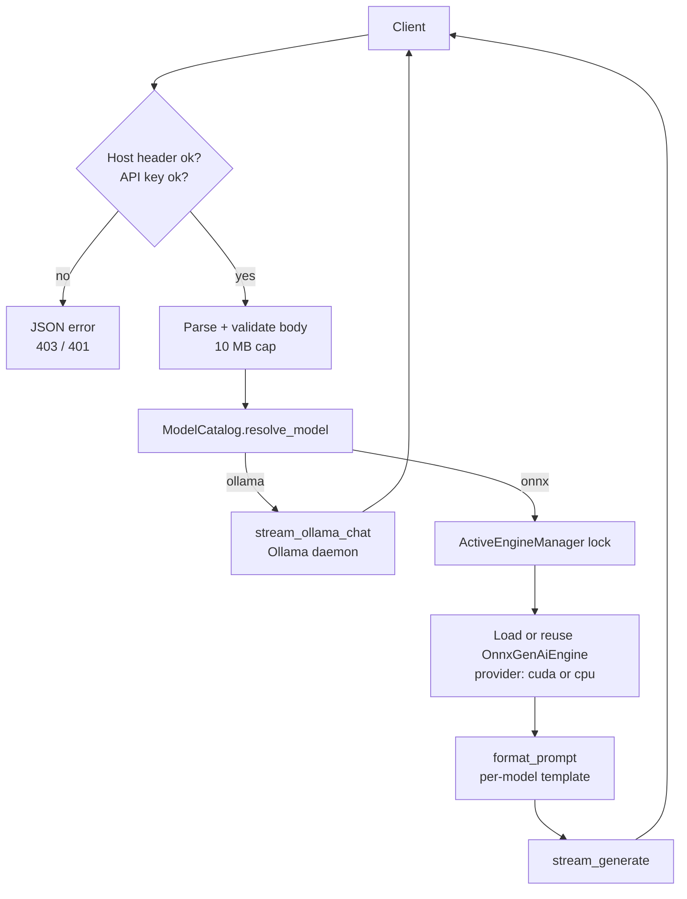

# Architecture

## Modules

| Module | Responsibility |
|---|---|
| `prism/cli.py` | Argument parsing and the subcommands; turns `AmbiguousModelError` / `ModelLoadError` into clean errors |
| `prism/catalog.py` | Model discovery (cached), name resolution, and `pull` (Hugging Face and Ollama) |
| `prism/paths.py` | Model search paths and the default download directory |
| `prism/templates.py` | Chat templates and per-model template detection (no heavy imports) |
| `prism/engine.py` | `OnnxGenAiEngine`: loads a model on a chosen execution provider, streams tokens, counts tokens, reports `device` and `finish_reason`. Defines the `Engine` protocol. |
| `prism/ollama_bridge.py` | Talks to the Ollama daemon: list, chat streaming, pull |
| `prism/server.py` | OpenAI-compatible HTTP server, auth/CORS/Host checks, the engine lock |
| `prism/telemetry.py` | NVML GPU info, CUDA library discovery/preload, CUDA provider probe |
| `prism/mcp.py`, `prism/connectors.py` | MCP stdio server and Cursor/Cline/MCP client configuration |
| `prism/chat.py`, `prism/benchmark.py` | Interactive chat and the micro-benchmark |

The package has no third-party runtime dependencies. `onnxruntime_genai` is imported lazily-tolerantly (`OG_AVAILABLE`), and
`huggingface_hub` only inside `pull`.

## Request flow

## Design decisions

- **Explicit execution provider.** The engine clears the `genai_config.json` provider list and requests `cuda` or `cpu`
  itself, and reports what it got. Silent fallbacks are treated as bugs.
- **One resident ONNX model, one lock.** ORT-GenAI engines are not safe to share across threads and swapping models
  unloads the previous one, so load and generation are serialized in `ActiveEngineManager.use_engine`.
- **Errors before headers.** Model loading and the first Ollama chunk are resolved before any response header is sent, so
  failures can be proper JSON errors rather than dropped connections.
- **Testable seams.** The server takes an `ActiveEngineManager` with an injectable `engine_factory`, and the catalog takes
  explicit search paths, so tests use fakes instead of a GPU.
