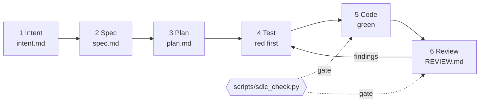

# Agent SDLC workflow

Prism carries a small, harness-neutral development process for AI coding agents (Claude Code, Codex, Cursor, Copilot, Gemini CLI). It
is optional for humans, and the normal [contribution steps](development.md) still apply. It follows the AI-native SDLC: every
non-trivial change moves through **intent, spec, plan, test, code, review**, and each stage ends in a **file that is committed to the
repository**, so the work is plannable, verifiable and resumable whichever tool does it.



| # | Stage | Artifact | Finished when |
|---|---|---|---|
| 1 | Intent | [`intent.md`](sdlc/intent.md) | Problem, outcome, constraints, non-goals and success criteria still hold. The operator approves changes |
| 2 | Spec | [`spec.md`](sdlc/spec.md) | The behavior is written: invariants, failure modes, the normative doc it changes |
| 3 | Plan | `plan.md` | Items name their files and tests; the operator approved |
| 4 | Test | `tests/` | The test was seen failing for the right reason (`--red`) |
| 5 | Code | `prism/` | The smallest change that turns it green |
| 6 | Review | [`REVIEW.md`](sdlc/review.md) | Independent review is clean, the gate exits 0, the operator decides |

`plan.md` is the state of the work: an item is ticked only after the gate passes, and each phase has a `Status:` line as the handoff
note. A bug fix starts at stage 4; a typo or a docs wording change skips stages 1 to 4.

## Layout

| Path | Role |
|---|---|
| `AGENTS.md` | Commands, the process table and the project rules, read by every agent. The single source of truth |
| `CLAUDE.md` | Imports `AGENTS.md` for Claude Code |
| `intent.md`, `spec.md`, `plan.md`, `REVIEW.md` | The artifacts of the stages above |
| `.agents/skills/<name>/SKILL.md` | One skill per stage group, plus the `sdlc` router. `.claude/skills` is a symlink to it |
| `scripts/sdlc_check.py` | The deterministic gate, and `--red` for the test-first stage |
| `.githooks/pre-commit` | Opt-in hook that runs the gate before every commit |

Start with `/sdlc` in Claude Code, or ask another agent to "use the sdlc skill". The router reads `plan.md` and git and names the stage.

| Skill | Stages |
|---|---|
| `sdlc` | finds the stage |
| `sdlc-plan` | 1 to 3 |
| `sdlc-implement` | 4 and 5 |
| `sdlc-review` | 6, with a fresh subagent or session |
| `sdlc-release` | commit, PR and release, only when the operator asks |

## The gate

```bash
python3 scripts/sdlc_check.py                # everything, diffed against main
python3 scripts/sdlc_check.py --only tests   # compile, tests, changelog or docs
python3 scripts/sdlc_check.py --base origin/main
```

### Red first

```bash
python3 scripts/sdlc_check.py --red tests.test_x.TestY.test_z
```

Exits `0` only when every named test **fails or errors** right now, and prints the exception line of each failure so the reason can
be read. A test that already passes proves nothing; a skipped, `expectedFailure`, timed-out (60 s) or non-existent test is not red
either. Test output is swallowed, and `--red` cannot be combined with `--only` or `--base`.

### Checks

| Check | Passes when |
|---|---|
| `compile` | `prism`, `foundry_wsl`, `tests` and `scripts` byte-compile |
| `tests` | The unit test suite passes |
| `changelog` | Runtime code changed **and** `CHANGELOG.md` changed, or no runtime code changed |
| `docs` | `mkdocs build --strict` passes (skipped when MkDocs is not installed) |

Exit status is `0` unless a check fails. CI runs the `changelog` check on every pull request.

### Pre-commit hook

```bash
git config core.hooksPath .githooks     # enable, once per clone
git config --unset core.hooksPath       # disable
```

The hook runs `compile`, `tests` and `changelog` (about 20 s) before each commit, from any agent, editor or terminal, and blocks the
commit when one fails. It checks the working tree, not only what is staged, so partial staging can hide a failure. It is opt-in
because it is slow; you can still bypass it with `git commit --no-verify`, agents must not.

## Principles

1. A stage is finished only when its artifact is on disk. State lives in files, not in the conversation.
2. Gates decide, not opinion: "done" means the gate exited 0 in this session.
3. Read the code and its tests before proposing a change; write the spec before the code.
4. Watch a test fail for the right reason before making it pass.
5. Review with fresh context, not in the session that wrote the code.
6. Intent changes, invariant changes, pushes, GitHub actions and releases happen only when the operator asks, every time.
